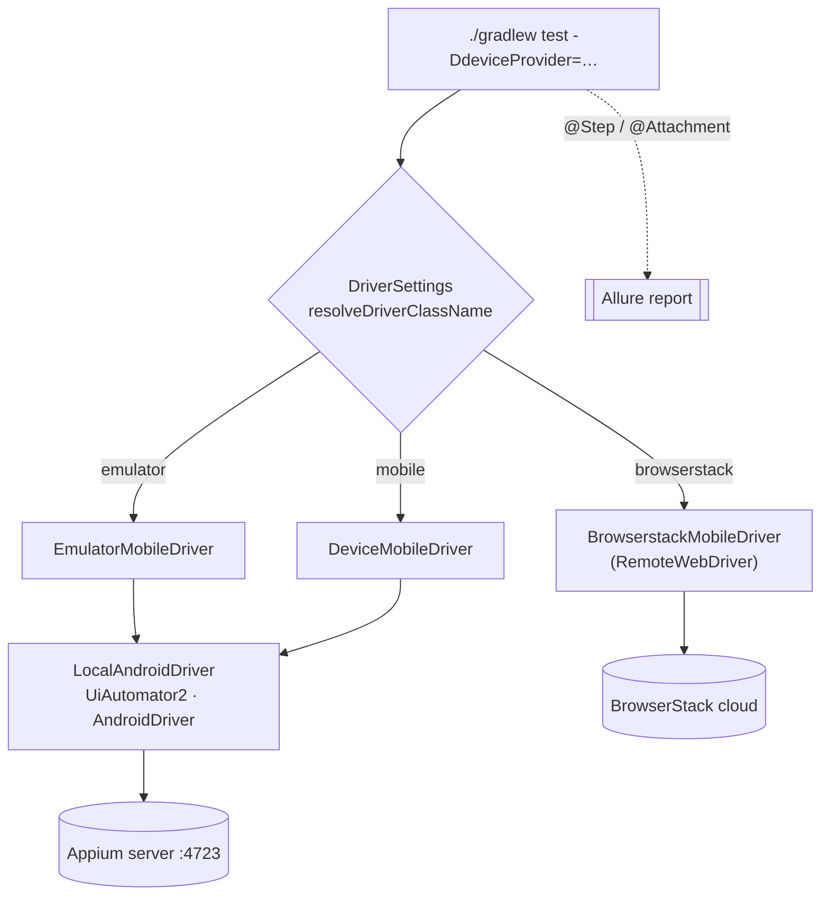
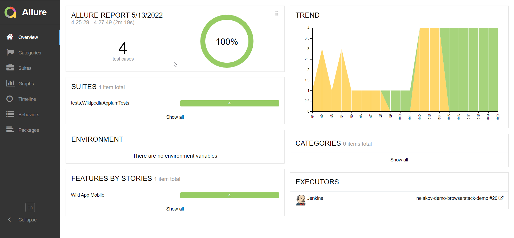
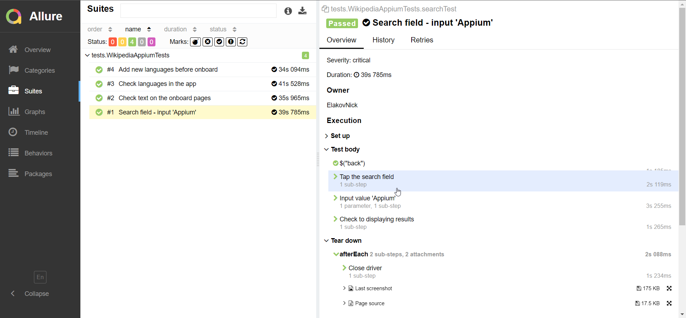
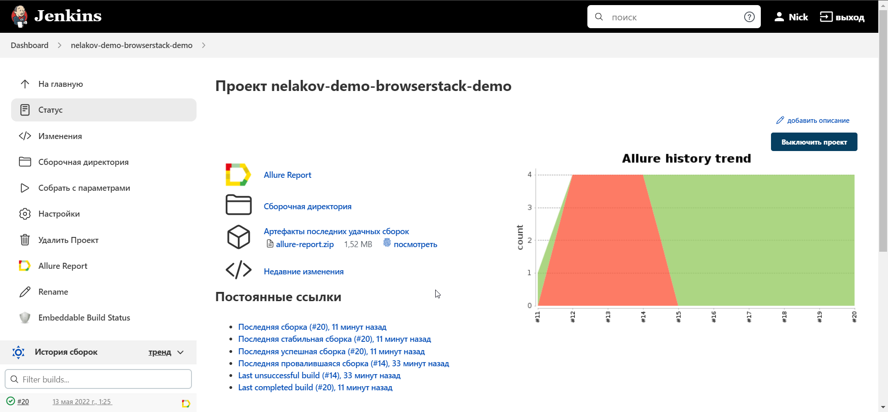
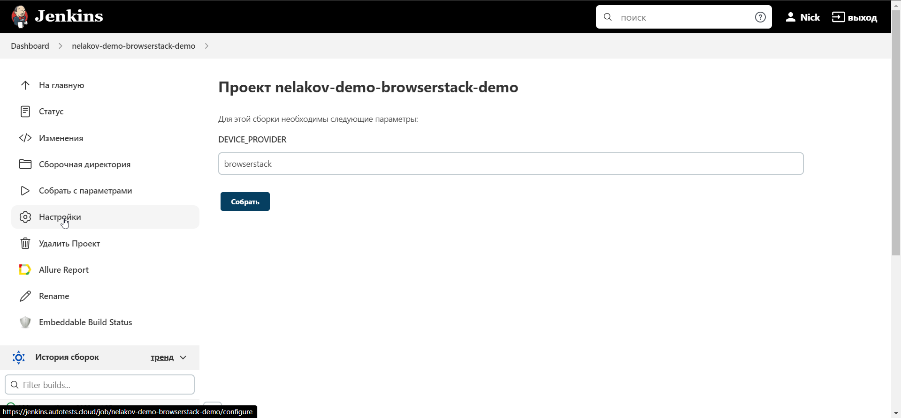

<div align="center">

# 📱 Wikipedia Android — UI Test Automation

**Mobile UI autotests for the [Wikipedia](https://github.com/wikimedia/apps-android-wikipedia) Android app
that run _unchanged_ across three environments — BrowserStack cloud, a local emulator, or a real device over USB.**


<br/>


</div>

---

## ✨ Highlights

- 🌍 **One codebase, three targets** — switch with a single `-DdeviceProvider` flag. No code changes.
- ⚙️ **Config-driven** — devices and credentials live in `.properties`, bound type-safely via the [Owner](https://matteobaccan.github.io/owner/) library.
- 🧩 **Zero-duplication drivers** — a shared `LocalAndroidDriver` (template method) powers both emulator and real device; subclasses differ only by which config they supply.
- 📊 **Rich reporting** — Allure with `@Step` annotations plus an automatic screenshot + page source on every test.
- 🤖 **CI-ready** — a parameterized Jenkins job runs the suite on demand.
- 🆕 **Modern stack** — Java 25, Gradle 9.5 (Kotlin DSL), JUnit 6, Selenide 7, Appium 9.

## 🧰 Tech stack

| Layer | Tooling |
|---|---|
| Language / build | Java 25 · Gradle 9.5 (`build.gradle.kts`, Kotlin DSL) |
| Test runner | JUnit 6 |
| UI driver | Selenide 7 over Appium 10 (`java-client`, UiAutomator2) |
| Config | Owner |
| Reporting | Allure 2.35 |
| Cloud devices | BrowserStack |
| CI | Jenkins |

## ✅ Test coverage

- ✔️ Onboarding screens — header text across all 4 pages
- ✔️ Search by query
- ✔️ Add a new language (and verify the languages list grows)
- ✔️ Verify the active interface language

## 🏗 Architecture

The `deviceProvider` system property selects a Selenide `WebDriverProvider` by class name; Selenide
instantiates it to build the Appium driver. Local emulator and physical device share one base class.



## 📂 Project structure

```
src/test/java
├── config/        # Owner config interfaces (LocalAndroidConfig, *Config) + Credentials factory
├── drivers/       # DriverSettings selector + WebDriverProviders (template method)
├── helpers/       # Attach — Allure screenshot & page-source attachments
├── tests/         # TestBase (lifecycle) + WikipediaAppiumTests
└── tests/steps/   # WikiSteps — @Step-annotated page actions
```

## 🚀 Getting started

### Prerequisites

- **JDK 25** (Gradle resolves the toolchain automatically)
- For local runs (`emulator` / `mobile`): an **Appium server on port 4723** and an Android emulator or a USB-connected device

### 1. Create the config file

Config `.properties` are **git-ignored** — create the one for your target. The APK auto-downloads if missing.

<details>
<summary><b>BrowserStack</b> — <code>src/test/resources/config/browserstack.properties</code></summary>

```properties
user=YOUR_BROWSERSTACK_USER
key=YOUR_BROWSERSTACK_KEY
app=bs://<uploaded-app-id>
device=Samsung Galaxy S22 Plus
os_version=12.0
project=Wikipedia Mobile
build=browserstack-build-1
name=wiki-suite
url=https://hub.browserstack.com/wd/hub
```
</details>

<details>
<summary><b>Emulator</b> — <code>src/test/resources/emulator.properties</code> (resources <b>root</b>)</summary>

```properties
platformName=Android
deviceName=Pixel_4_API_30
platformVersion=11.0
locale=en
language=en
appPackage=org.wikipedia.alpha
appActivity=org.wikipedia.main.MainActivity
appUrl=https://github.com/wikimedia/apps-android-wikipedia/releases/download/latest/app-alpha-universal-release.apk?raw=true
appPath=src/test/resources/apk/app-alpha-universal-release.apk
serverUrl=http://localhost:4723/wd/hub
```
</details>

<details>
<summary><b>Real device</b> — <code>src/test/resources/config/samsung.properties</code> (same keys as emulator)</summary>

```properties
platformName=Android
deviceName=<your device name from `adb devices`>
platformVersion=<android version>
locale=en
language=en
appPackage=org.wikipedia.alpha
appActivity=org.wikipedia.main.MainActivity
appUrl=https://github.com/wikimedia/apps-android-wikipedia/releases/download/latest/app-alpha-universal-release.apk?raw=true
appPath=src/test/resources/apk/app-alpha-universal-release.apk
serverUrl=http://localhost:4723/wd/hub
```
</details>

> ⚠️ Paths match the `@Config.Sources` annotations in `config/*.java`. The emulator file lives at the
> resources **root**; BrowserStack and Samsung configs live under `config/`.

### 2. Run

```bash
./gradlew clean test -DdeviceProvider=browserstack   # remote BrowserStack farm
./gradlew clean test -DdeviceProvider=emulator       # local Android emulator
./gradlew clean test -DdeviceProvider=mobile         # real device over USB
```

| BrowserStack | Emulator | Real device |
|:---:|:---:|:---:|
|  |  |  |

## 📈 Allure report

```bash
allure serve build/allure-results
```

| Overview | Test result |
|:---:|:---:|
|  |  |

## 🔧 CI — Jenkins

A parameterized job runs the suite against any environment.
**[▶ Open the Jenkins job](https://jenkins.autotests.cloud/job/nelakov-demo-browserstack-demo/)**

| Job | Parameters |
|:---:|:---:|
|  |  |
